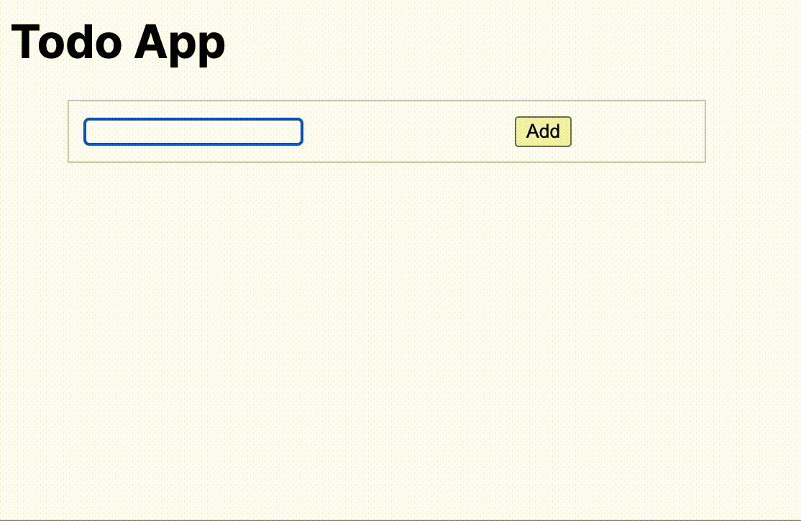

# todo-app-next-js-server-action

This project is a todo app that demonstrates how to use Server Action in Next.js.



## How to bootstrap this project

1. Start frontend server

```bash
$ cd frontend
$ npm ci
$ npm run dev
``````

2. Start backend server

```bash
$ cd backend
$ make serve
```

3. open http://localhost:3000


